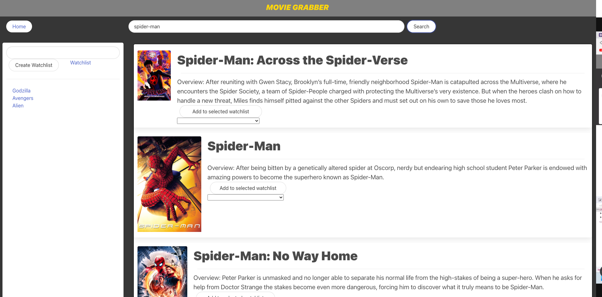

# movie-grabber

## Description
Movie-Grabber is a simple movie search application. The user can click on the search bar and enter a movie name, click search and the application displays a list of movies with similar titles. Each movie card gives the basic info for that movie along with the movie poster. The user can create a custom named list of movies user wants to watch by adding a watchlist. 

## Usage
Access Movie-Grabber at [https://gfuselier.github.io/movie-grabber/](https://gfuselier.github.io/movie-grabber/)

## Technologies
* Bulma CSS Framework
* The Open Movie Database (OMDB) API
* The Movie Database (TMDB) API

## Acknowledgements
Collaborators:
* Holden Harvey
* Josiah Thomas
* Mohit Dhankher
* Fred Kamm